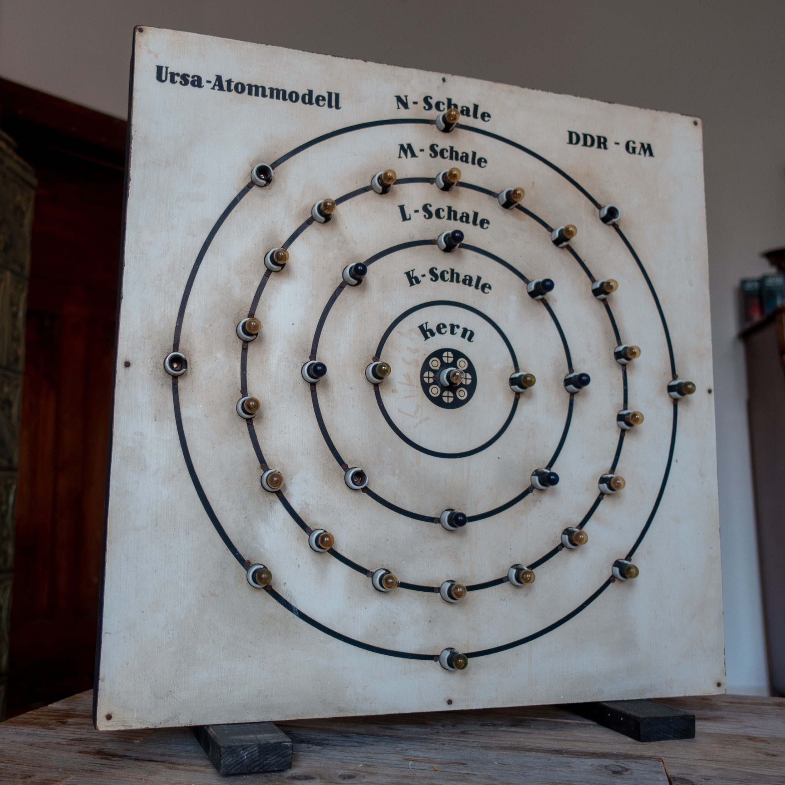
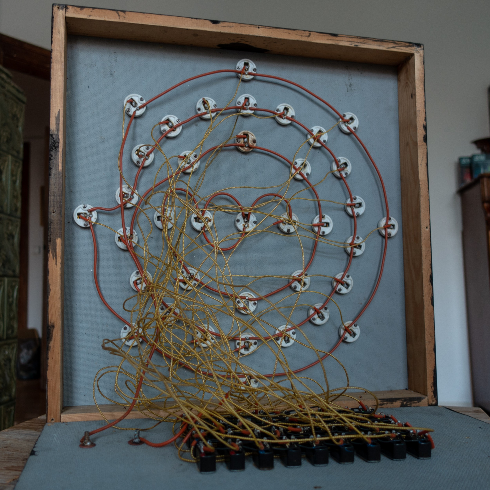

# Atommodell
Upcyclingprojekt eines alten Atommodells aus den 1950er Jahren.

Das Original war über ein einfaches Schaltfeld steuerbar. In der aktuellen Version ist das Schaltfeld nicht funktional.

## Hardware used 

 - ESP32 nodemcu (AZDelivery)
 - 4x GPIO-expander PCF8574
 - 2x 16-Relaisboard (12 V Schaltspannung)
 - 1x 4-Relaisboard (5 V Schaltspannung)
 - 1x 3,3 V Netzteil (geregelt auf 2,9 V)
 - 1x 12 V / 5 V Netzteil
 - 37x 6 V E10 Glühbirnen (betrieben auf 2,9 V)

https://github.com/kleinerELM/Atommodell/blob/main/assets/old.mp4?raw=true

## Software

Das Projekt nutzt das SPIFFS Filesystem für Schriftarten und HTML-Templates. Daher musst zuerst "Build Filesystem Image" und im Anschlusss "Upload Filesystem Image" unter "Platform" ausgeführt werden.
