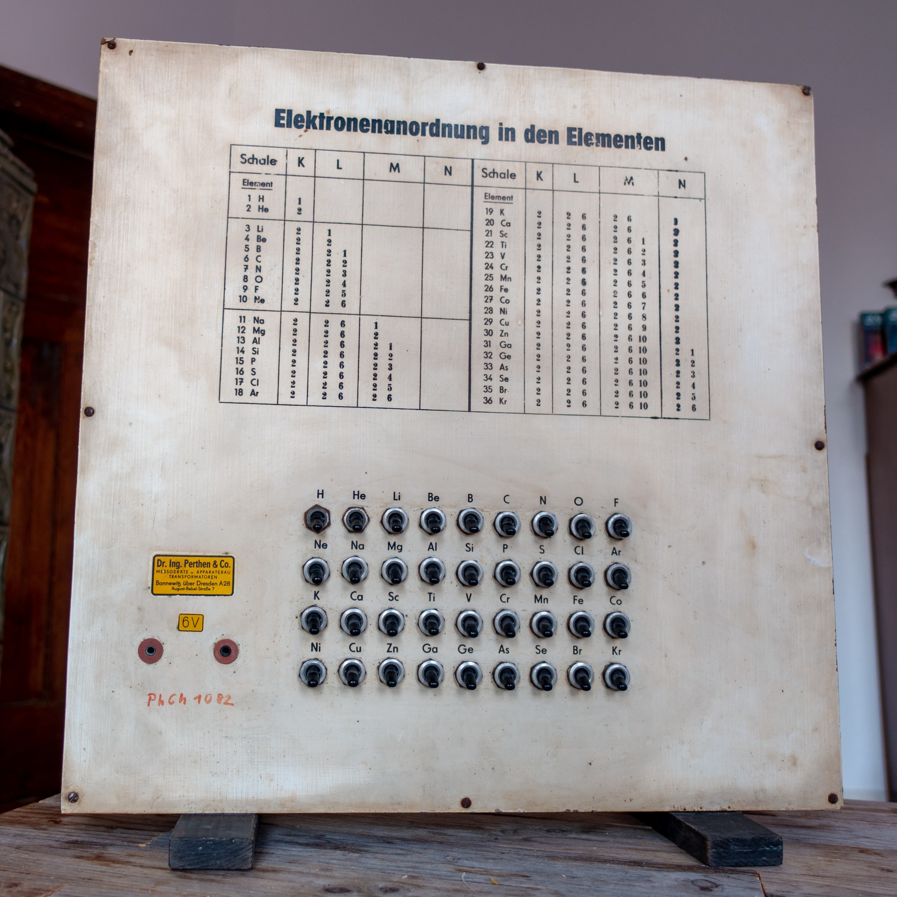
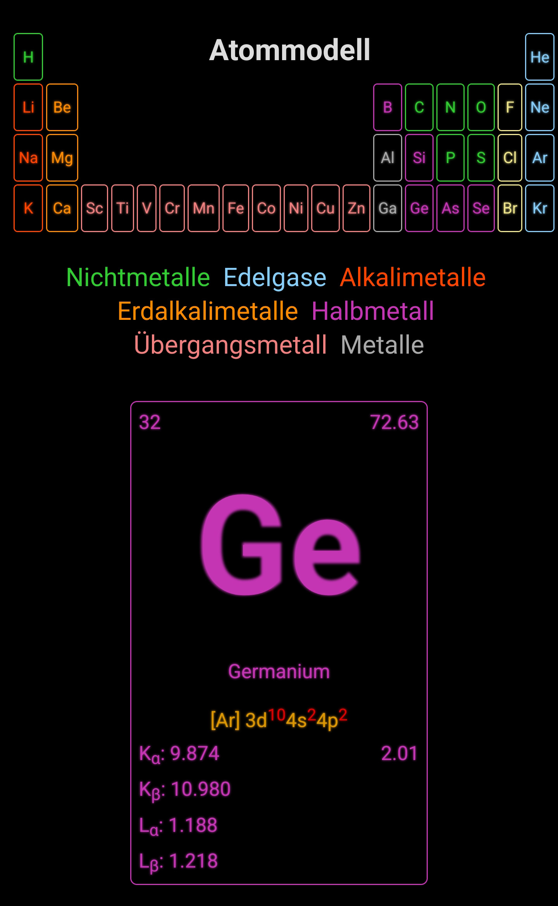

# Atommodell
Upcyclingprojekt eines alten Atommodells aus den 1950er Jahren.

Das Original war über ein einfaches Schaltfeld steuerbar. In der aktuellen Version ist das Schaltfeld nicht funktional.

## Hardware used 

 - ESP32 nodemcu (AZDelivery)
 - 4x GPIO-expander PCF8574
 - 2x 16-Relaisboard (12 V Schaltspannung)
 - 1x 4-Relaisboard (5 V Schaltspannung)
 - 1x 3,3 V Netzteil (geregelt auf 2,9 V)
 - 1x 12 V / 5 V Netzteil
 - 37x 6 V E10 Glühbirnen (betrieben auf 2,9 V)

https://github.com/kleinerELM/Atommodell/blob/main/assets/old.mp4?raw=true

## Software

Der Controller ist als Accesspoint eingerichtet. Nach dem Start wartet das Gerät darauf, dass sich ein Client verbindet und zeigt die Logindaten an.

Nach dem Verbinden mit dem Atommodell, muss die entsprechende Webseite aufgerufen werden ( Standard: http://1.3.3.7/ ).
Wurde ein Element ausgewählt, werden auf im Webinterface und auf dem Display verschiedene Informationen zum ausgeählten Element angezeigt (Elementnummer, Atommasse, Elektronenkofigurationen, K- und L-Linien und Elektronegativität).

### Webinterface

Eine Vorschau des Webinterfaces findet sich hier:

https://htmlpreview.github.io/?https://github.com/kleinerELM/Atommodell/blob/main/assets/preview.html

### Animationen

Die folgenden Videos zeigen das Modell in Aktion.

Bootanimation:

https://youtube.com/shorts/tEt-So7ehgk

Elementanimation:

https://youtube.com/shorts/_n3W5lgX1GE

### Compilierungshinweis

Das Projekt nutzt das SPIFFS Filesystem für Schriftarten und HTML-Templates. Daher musst zuerst "Build Filesystem Image" und im Anschlusss "Upload Filesystem Image" unter "Platform" ausgeführt werden.
